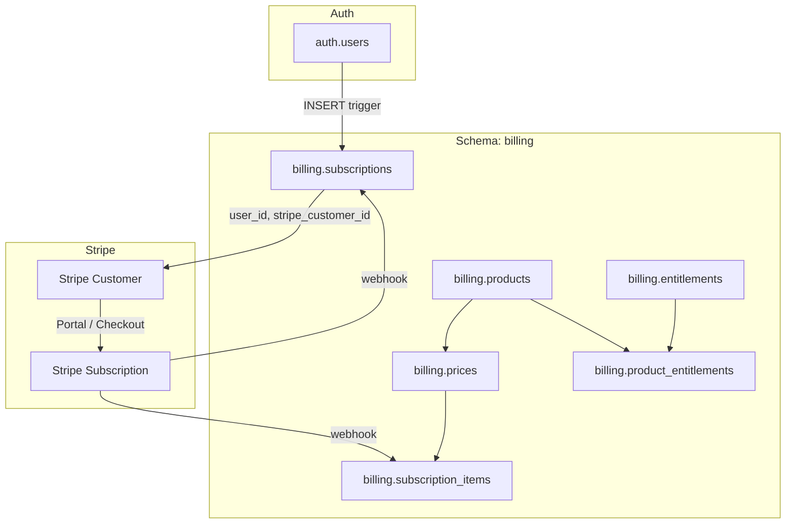

# Phased Billing: Consolidated Milestones (Updated)

This plan adds: **billing schema** (all billing tables under `billing`), **new-user record + Stripe Customer** for every new user unless they start as paid, and **completion status** per milestone.

---

## Current status (completed / pending)

| Milestone | Status | Completion |

|-----------|--------|------------|

| **0. Catalog in Supabase** | Partially done | ~85% |

| **1. Billing schema + new user + Stripe Customer** | Not started | 0% |

| **2. Catalog in Stripe + Checkout** | Done | 100% |

| **3. Webhook sync + access until period end** | Partially done | ~55% |

| **4. Proration docs + E2E** | Not started | 0% |

---

## Milestone 0: Catalog in Supabase (Phases 1 + 2)

**Status:** Partially done (~85%).

**Tangible outcome:** Insert full catalog (products, prices, entitlements, product_entitlements) from user-style answers into Supabase. Add `entitlements.stripe_feature_id` if not present. Tables use `public` schema until Milestone 1 moves them to `billing`.

**Scope**

- Phase 1: Migration adds `entitlements.stripe_feature_id` (TEXT UNIQUE, nullable) in `public` if using Option C later.
- Phase 2: write_supabase_catalog (or equivalent) inserts into `public.products`, `public.prices`, `public.entitlements`, `public.product_entitlements` (current behavior).

**Verification**

1. **Phase 1:** Apply migration and confirm column exists.
   ```bash
   supabase db push
   ```
   Then in SQL or Table Editor: `SELECT column_name FROM information_schema.columns WHERE table_schema = 'public' AND table_name = 'entitlements' AND column_name = 'stripe_feature_id';` — expect 1 row.

2. **Phase 2:** Call MCP `write_supabase_catalog` (or equivalent) with a fixture (products, prices, entitlements, product_entitlements). Do not pass `schema` so it uses default `public`. Then query `SELECT * FROM public.products;`, `public.prices`, `public.entitlements`, `public.product_entitlements` — row counts and FKs correct.

---

## Milestone 1: Billing schema + new user record + Stripe Customer

**Tangible outcome:** All billing tables live in schema `billing`. Every new user gets a subscription row (free) in Supabase and a Stripe Customer; free users can open Customer Portal for upgrade without going through Checkout first.

**Scope**

1. **Billing schema**

   - Create schema `billing`. Create (or move) all billing tables under `billing`: `billing.subscriptions`, `billing.products`, `billing.prices`, `billing.entitlements`, `billing.product_entitlements`, `billing.subscription_items`.
   - Tables today are in `public` ([001_subscriptions_table.sql](supabase/migrations/001_subscriptions_table.sql), [002_products_prices_entitlements.sql](supabase/migrations/002_products_prices_entitlements.sql)). Approach: add a new migration that creates `billing` schema and creates these tables in `billing` with the same structure (or, for existing deployments, create `billing`, create tables in `billing`, migrate data from `public`, then drop `public` billing tables and update FKs). For a clean baseline, one option is a single migration `00X_billing_schema.sql` that: `CREATE SCHEMA IF NOT EXISTS billing;` then `CREATE TABLE billing.subscriptions (...);` etc., with FKs referencing `billing.*` and `auth.users` where needed.
   - Move the "create subscription for new user" logic into `billing`: trigger on `auth.users` (AFTER INSERT) inserts into `billing.subscriptions` (user_id, plan_id='free', status='active', product_id=Free product if available). Drop or disable the old trigger that inserted into `public.subscriptions` if migrating.
   - RLS: enable RLS on all `billing.*` tables; policies same as today (users read own subscription; service_role full; catalog read for authenticated). Grant `USAGE ON SCHEMA billing` to appropriate roles.
   - Expose `billing` in Supabase API (Project Settings > API > "Exposed schemas" or equivalent) so the REST API can access it.

2. **App and Edge Functions use billing schema**

   - Supabase JS client: use `.schema('billing').from('subscriptions')` (and same for `products`, `prices`, `entitlements`, `product_entitlements`, `subscription_items`) everywhere billing tables are read or written. Files to update: [src/components/SubscriptionProvider.tsx](src/components/SubscriptionProvider.tsx) (e.g. `.from('subscriptions')` -> `.schema('billing').from('subscriptions')`), [supabase/functions/create-checkout/index.ts](supabase/functions/create-checkout/index.ts), [supabase/functions/create-portal/index.ts](supabase/functions/create-portal/index.ts), [supabase/functions/stripe-webhook/index.ts](supabase/functions/stripe-webhook/index.ts), [mcp-server/src/tools/write-supabase-catalog.ts](mcp-server/src/tools/write-supabase-catalog.ts) (products, prices, entitlements, product_entitlements). Edge Functions need to use the **service_role** client when writing to billing (e.g. webhook, create-checkout updating subscription); ensure RLS allows service_role.

3. **New user: subscription row + Stripe Customer**

   - **Subscription row:** Already done by trigger: on `auth.users` INSERT, insert one row into `billing.subscriptions` with plan_id='free', status='active', product_id=NULL or Free product id if you have one. Trigger must reference `billing.subscriptions` (see above).
   - **Stripe Customer for every new user (unless they start as paid):** Create a Stripe Customer when the user is created (or on first need) and set `billing.subscriptions.stripe_customer_id`. Options:
     - **Option A (recommended):** After signup, the app calls an Edge Function (e.g. `ensure-stripe-customer` or `onboard-user`) that: (1) gets current user; (2) reads `billing.subscriptions` for that user_id; (3) if `stripe_customer_id` is null, creates Stripe Customer (email, metadata.user_id), updates `billing.subscriptions` set stripe_customer_id where user_id; (4) returns. Call this once after login/signup (e.g. in SubscriptionProvider mount or auth callback) so every user gets a Stripe Customer without going through Checkout.
     - **Option B:** Supabase Auth webhook (e.g. "user signed up") that calls an Edge Function to create Stripe Customer and update billing.subscriptions; requires webhook URL and secret.
   - "Unless he starts as paid": If a user signs up and immediately goes to Checkout (paid), create-checkout already creates a Stripe Customer if missing and updates the subscription. So creating Stripe Customer at signup (Option A or B) does not conflict; it just ensures free users have stripe_customer_id for "Upgrade" CTA to Portal. No change needed for paid-first flow.

**Deliverables**

- Migration(s): `CREATE SCHEMA billing`; create all billing tables in `billing`; trigger on auth.users inserting into `billing.subscriptions`; RLS and grants on `billing`.
- Code: All queries to subscriptions, products, prices, entitlements, product_entitlements, subscription_items use `supabase.schema('billing').from(...)` (and Edge Functions use service_role where they write).
- New Edge Function (e.g. `ensure-stripe-customer`): creates Stripe Customer if subscription has no stripe_customer_id, updates billing.subscriptions; called from app after signup/login.
- Docs: Short note in SETUP or IMPLEMENTATION_GUIDE that billing tables are in schema `billing` and that new users get a free subscription row + Stripe Customer.

**Verification**

1. New user signs up: one row in `billing.subscriptions` (plan_id=free, status=active); after app calls ensure-stripe-customer (or after first load that triggers it), stripe_customer_id is set.
2. In Stripe Dashboard: new Customer exists with same email; metadata or email can be used to match user.
3. Upgrade CTA to Customer Portal: free user opens Portal without going through Checkout (create-portal uses stripe_customer_id from billing.subscriptions).
4. All existing flows (create-checkout, create-portal, stripe-webhook, SubscriptionProvider) use billing schema and still work.

**Success criteria**

- [x] All billing tables exist only under schema `billing`; no billing tables in `public`. (Run migration 006 to drop public billing tables if not yet applied.)
- [x] New user gets one row in `billing.subscriptions` (free) and a Stripe Customer; stripe_customer_id stored.
- [x] App and Edge Functions use `billing` schema for all billing table access.

---

## Milestone 2: Catalog in Stripe + Checkout (Phases 3 + 4 + 5)

**Status:** Done.

**Tangible outcome:** Sync catalog to Stripe (Products, Prices, Option C column); create-checkout uses Supabase for trial when applicable; webhook resolves plan from billing catalog and writes subscription_items; all catalog and subscription reads/writes use `billing` schema.

**Scope**

- All Supabase reads/writes in create-checkout, stripe-webhook, create-portal, and catalog tools use `billing` schema (from Milestone 1).
- Rest of Phase 3, 4, 5: trial from DB, price→plan from DB, Option C column, subscription_items sync.

**Implemented**

- **Migration 006:** `billing.entitlements.stripe_feature_id` (Option C) added.
- **create-checkout:** Looks up `billing.prices` by `stripe_price_id`; uses `trial_days` from DB when request does not pass `trial_period_days` (request body overrides).
- **stripe-webhook:** Plan resolved from `billing.prices` + `billing.products` (plan_id = lower(product.name)); no hardcoded price→plan map. Writes `billing.subscription_items` on checkout.session.completed, customer.subscription.created, and customer.subscription.updated.
- **Catalog sync to Stripe:** Use MCP `create_stripe_catalog`; then `write_supabase_catalog` with schema `billing` to populate products/prices/entitlements/product_entitlements.

**Verification**

1. Run migration 006: `supabase db push` — then `SELECT column_name FROM information_schema.columns WHERE table_schema = 'billing' AND table_name = 'entitlements' AND column_name = 'stripe_feature_id';` returns 1 row.
2. Checkout with a price that has `trial_days` in `billing.prices` and no `trial_period_days` in request — Stripe session should have trial.
3. After checkout or subscription update, `billing.subscription_items` has rows for the subscription; plan on `billing.subscriptions` matches product name (lowercased) from catalog.

---

## Milestone 3: Webhook sync + access until period end (Phases 6 + 7 + 8)

**Status:** Partially done (~55%).

**Tangible outcome:** Unchanged: webhook resolves price to product_id, writes subscription_items, grant-safe delete; app allows access until current_period_end. All subscription/subscription_items updates use `billing` schema.

**Scope**

- Webhook and SubscriptionProvider use `billing.subscriptions` and `billing.subscription_items` (and related catalog tables in `billing`).

---

## Milestone 4: Proration docs + E2E (Phases 9 + 10)

**Status:** Not started.

**Tangible outcome:** Unchanged: proration documented; full E2E flow testable (catalog in billing, sync to Stripe, new user + Stripe Customer, upgrade via Portal or Checkout, webhook updates billing tables, access until period end).

---

## Schema and data flow (after Milestone 1)



---

## Implementation order

1. **Milestone 0:** Catalog in Supabase (Phases 1 + 2): add `entitlements.stripe_feature_id`; insert products, prices, entitlements, product_entitlements into `public` via write_supabase_catalog.
2. **Milestone 1:** Billing schema migration; move/create all billing tables in `billing`; update trigger to insert into `billing.subscriptions`; update all code to use `.schema('billing')`; add ensure-stripe-customer (or equivalent) and call it after signup so every new user gets a Stripe Customer.
3. **Milestones 2–4:** As in original plan, with all table references using `billing` schema.

No other changes to the phased scope of Milestones 1–4 beyond schema and new-user + Stripe Customer behaviour above.